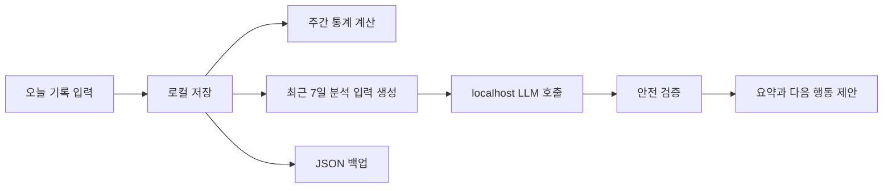

# 하루건강: Daily Logger

> 식사, 체중, 물 섭취, 운동, 컨디션을 한 곳에 기록하고 로컬 AI로 생활 패턴을 분석하는 개인 건강 로그 앱입니다.


---

## 1. 한 장 요약

**Daily Logger**는 서버 회원가입 없이 브라우저 안에서 동작하는 식단 기록 도구입니다.

- 일일 식사, 체중, 물 섭취, 운동, 컨디션 기록
- IndexedDB 기반 로컬 저장소
- 주간 평균과 최근 8주 체중 흐름 분석
- Ollama 호환 로컬 LLM을 이용한 식단/생활 패턴 분석
- 음식명 기반 칼로리 범위 추정
- JSON 백업과 복원
- 원격 LLM endpoint 차단과 안전 검증

이 프로젝트의 핵심 방향은 **개인 건강 데이터를 외부 서버로 보내지 않고, 사용자의 기기 안에서 기록과 분석을 끝내는 것**입니다.

---

## 2. 문제 정의

건강 기록 앱은 많지만, 개인 식단 데이터는 민감합니다.

| 문제 | 사용자가 겪는 불편 |
| --- | --- |
| 데이터가 서버에 저장됨 | 식단, 체중, 생활 패턴이 외부 서비스에 남음 |
| 기록은 쉽지만 해석이 어려움 | 숫자만 쌓이고 행동으로 이어지지 않음 |
| AI 분석은 원격 API 중심 | 민감한 로그가 외부 모델로 전송될 수 있음 |
| 누락 데이터 처리 미흡 | 빈 날짜나 미기록 값을 0처럼 해석해 통계를 왜곡 |

---

## 3. 제안하는 해결책

Daily Logger는 세 가지 원칙으로 설계했습니다.

| 원칙 | 구현 방식 |
| --- | --- |
| Local-first | 기록, 설정, AI 분석 캐시를 브라우저 IndexedDB에 저장 |
| Privacy by design | Ollama 호환 localhost endpoint만 허용 |
| Actionable insight | 주간 통계와 로컬 AI 분석으로 다음 행동을 제안 |

사용자는 매일 짧게 기록하고, 앱은 누락값을 보수적으로 처리하며, 필요할 때만 로컬 모델을 호출합니다.

---

## 4. 사용자 흐름



---

## 5. 핵심 기능

### 일일 기록

- 날짜별 로그 생성, 조회, 수정, 삭제
- 체중, 물 섭취량, 5단계 컨디션 기록
- 아침, 점심, 저녁, 간식 식사명과 칼로리 입력
- 운동명과 운동 시간 기록
- 자유 메모 작성
- 일일 총 칼로리 자동 합산
- 입력 범위 검증과 접근 가능한 오류 피드백

### 주간 인사이트

- 월요일 기준 주간 집계
- 평균 체중, 평균 칼로리, 평균 운동 시간 계산
- 지난주 대비 증감률 표시
- 최근 8주 평균 체중 추이
- 기록하지 않은 날짜와 체중 결측치를 0으로 왜곡하지 않는 계산

### 로컬 AI 분석

- 최근 7일 기록을 사용자가 직접 분석 실행
- Ollama 호환 endpoint 연결 확인
- 설치된 모델 선택
- 분석 요약, 긍정적 패턴, 리스크, 다음 행동 제공
- Zod 스키마 기반 구조화 응답 검증
- 생성 취소, 재시도, 타임아웃, 캐시 처리
- 모델, 날짜, 프롬프트 버전 기반 캐시 무효화

### 음식 칼로리 추정

- 음식명, 1인분, 조리 방식, 제품 정보를 바탕으로 로컬 AI 추정
- 최소/최대 범위와 대표값 제공
- 사용자가 확인한 경우에만 기록에 반영
- 개인 음식 사전에 저장해 동일 조건 재사용
- 직접 수정 시 AI 추정값 대신 수동 입력으로 전환
- 미산정 음식은 통계 합산에서 별도 건수로 표시

### 데이터 관리

- 목표 체중과 일일 목표 칼로리 설정
- 버전 포함 JSON 백업/복원
- Zod 스키마 기반 복원 검증
- 중복 날짜와 예상 밖 백업 구조 차단
- 개별 기록 삭제와 전체 데이터 삭제

---

## 6. 현재 구현 상태

| 영역 | 상태 | 검증 |
| --- | --- | --- |
| 일일 기록 MVP | 완료 | 빌드, 테스트 통과 |
| 주간 평균 통계 | 완료 | 경계값, 누락값, UI 테스트 통과 |
| 로컬 LLM 분석 | 완료 | 사전 로딩, 스트리밍, 타임아웃, mock 테스트 통과 |
| 음식 칼로리 추정 | 완료 | 사용자 확인, 개인 사전, 범위 검증 테스트 통과 |
| 실제 Ollama 모델 E2E | 환경별 추가 확인 필요 | 대형 모델은 로컬 메모리 제약 가능 |
| IndexedDB v1 -> v3 마이그레이션 | 브라우저 통합 검증 필요 | 스키마 단위 테스트 보유 |

---

## 7. 아키텍처


### 설계 포인트

| 설계 | 의도 |
| --- | --- |
| Repository 패턴 | UI가 Dexie 구현에 직접 의존하지 않도록 분리 |
| Zod 스키마 | 입력, 백업, AI 응답을 동일한 방식으로 검증 |
| Loopback-only LLM client | localhost, 127.0.0.1, [::1] 외 endpoint 차단 |
| 파생 통계 | 평균값을 저장하지 않고 원본 기록에서 재계산 |
| AI 결과 캐시 | 동일 입력 재분석 비용을 줄이고 stale 결과를 구분 |

---

## 8. 기술 스택

| 영역 | 기술 | 역할 |
| --- | --- | --- |
| Frontend | React, TypeScript | 모바일 우선 UI와 상태 관리 |
| Build | Vite | 개발 서버와 프로덕션 번들 |
| Persistence | IndexedDB, Dexie | 기록, 설정, AI 분석 캐시 저장 |
| Validation | Zod | 입력, 백업, 모델 응답 검증 |
| Local AI | Ollama-compatible HTTP API | 외부 AI API 없는 로컬 분석 |
| Security | Web Crypto SHA-256 | 분석 입력 캐시 키 생성 |
| Test | Vitest, Testing Library, jsdom | 도메인, 저장소, UI 검증 |
| Quality | ESLint | TypeScript와 React 정적 검사 |

---

## 9. 프로젝트 구조

```text
src/
  analysis/              # 분석 입력, 프롬프트, 스키마, 안전 정책
  app/                   # 공용 화면 모델, 서비스, AI 컨트롤러
  components/            # 공용 UI 컴포넌트
  domain/                # 기록 모델, Zod 스키마, 통계 로직
  features/
    analysis/            # 로컬 AI 설정, 상태, 결과 UI
    calorie-estimation/  # 음식별 칼로리 추정 UI와 컨트롤러
    daily-log/           # 오늘 기록 화면
    history/             # 지난 기록 화면
    insights/            # 주간 평균 통계 화면
    settings/            # 목표, 백업, 데이터 관리 화면
  llm/                   # loopback endpoint 검증과 Ollama HTTP 클라이언트
  runtime/               # 로컬 모델 리소스 추정
  storage/               # Dexie DB, Repository, 백업 서비스
  styles/                # 글로벌 스타일
  test/
    ai/                  # 프롬프트, 안전, HTTP 클라이언트 테스트
    backend/             # 도메인, 통계, 저장소 테스트
    frontend/            # 사용자 흐름과 UI 상태 테스트
```

---

## 10. 빠른 시작

### 요구 환경

- Node.js 20 이상 권장
- npm
- IndexedDB를 지원하는 최신 브라우저
- AI 분석 사용 시 Ollama 호환 로컬 런타임과 모델

### 설치와 실행

```bash
npm install
npm run dev
```

### 프로덕션 빌드

```bash
npm run build
```

---

## 11. 로컬 AI 설정

이 앱은 모델을 자동 설치하거나 다운로드하지 않습니다. 사용자가 직접 Ollama 호환 런타임과 모델을 준비해야 합니다.

예시:

```bash
ollama pull qwen3:8b
ollama run qwen3:8b
```

앱에서 사용하는 흐름:

1. Ollama 서버를 실행합니다.
2. 앱에서 일일 기록을 먼저 저장합니다.
3. 로컬 AI 연결 설정을 엽니다.
4. 기본 주소 `http://127.0.0.1:11434`로 연결을 확인합니다.
5. 설치된 모델을 선택합니다.
6. 모델 파일 크기와 리소스 경고를 확인합니다.
7. 필요하면 모델 사전 로딩을 실행합니다.
8. 준비가 끝나면 로컬 AI 분석을 실행합니다.

기본 응답 제한 시간은 300초이며, 120초 또는 600초로 변경할 수 있습니다. 모델은 Ollama에서 10분간 유지되도록 `keep_alive`를 사용합니다.

---

## 12. 보안과 개인정보

- 원본 기록은 브라우저 IndexedDB에 저장됩니다.
- JSON 백업은 사용자가 직접 내보내거나 가져올 때만 처리됩니다.
- 로컬 AI 분석과 칼로리 추정은 사용자가 실행할 때만 기록 데이터를 로컬 LLM 프로세스로 전달합니다.
- 인증 토큰, 비밀번호, 모델 원문 응답은 저장하지 않습니다.
- localhost가 아닌 LLM endpoint는 차단합니다.
- 의료 진단, 처방, 극단적 감량 조언은 안전 정책으로 차단합니다.
- 이 앱은 생활 기록을 정리하기 위한 도구이며 의료 진단이나 치료를 제공하지 않습니다.

---

## 13. 검증

```bash
npm test
npm run lint
npm run build
```

현재 문서화된 검증 결과:

| 검증 | 결과 |
| --- | --- |
| 프로덕션 빌드 | 통과 |
| 자동 테스트 | 13개 파일, 89개 테스트 통과 |
| ESLint | 오류와 경고 없음 |

주요 테스트 범위:

- 일일 기록 CRUD와 입력 검증
- 날짜 전환, 미래 날짜, 중복 날짜 처리
- 주간 평균과 결측치 처리
- 백업 JSON 검증과 복원 실패 케이스
- loopback URL 제한과 원격 endpoint 차단
- 모델 연결, 취소, 타임아웃, 오류 정규화
- 음식 칼로리 범위 검증과 사용자 확인 흐름
- AI 출력 스키마 보정과 위험 조언 차단
- 분석 캐시와 stale 결과 구분

---

## 14. 개발 산출물

기능별 요구사항, 설계, 작업 분해, 구현 기록, 테스트 리포트를 보존했습니다.

- [일일 기록 MVP](artifacts/wf_20260619_daily_diet_log/)
- [주간 평균 통계](artifacts/wf_20260619_weekly_average_stats/)
- [로컬 LLM 분석](artifacts/wf_20260619_local_llm_analysis/)
- [로컬 AI 런타임 안정성](artifacts/wf_20260619_local_ai_runtime_reliability/)
- [음식명 기반 칼로리 추정](artifacts/wf_20260620_food_calorie_estimation/)
- [앱 화면 분리](artifacts/wf_20260621_app_screen_split/)

---

## 15. 알려진 제한

- 대형 Ollama 모델은 GPU VRAM과 시스템 RAM에 따라 로딩에 실패할 수 있습니다.
- 실제 모델의 한국어 응답 품질, 속도, JSON 준수율은 7B~9B급 Q4 모델 기준으로 추가 평가가 필요합니다.
- IndexedDB v1 -> v3 데이터 보존은 실제 브라우저 통합 테스트가 더 필요합니다.
- Chromium 기반 360px 폭 모바일 시각 회귀 테스트가 필요합니다.
- 배포 환경에서는 origin, Ollama CORS, mixed-content 동작을 확인해야 합니다.
- 현재는 단일 기기와 단일 사용자 흐름을 기준으로 합니다.

---

## 16. 다음 단계

- [ ] 후보 로컬 모델별 한국어 분석 품질 평가
- [ ] 실제 브라우저 IndexedDB 마이그레이션 E2E
- [ ] 모바일 시각 회귀와 접근성 자동화
- [ ] 자주 먹는 음식과 식사 템플릿
- [ ] 필수 영양소와 탄단지 분석
- [ ] PWA 설치와 오프라인 정적 자산 캐시
- [ ] 선택형 클라우드 동기화

---

## 17. 라이선스

현재 별도의 라이선스가 지정되어 있지 않습니다. 공개 배포 또는 재사용을 허용하려면 `LICENSE` 파일을 추가해야 합니다.
