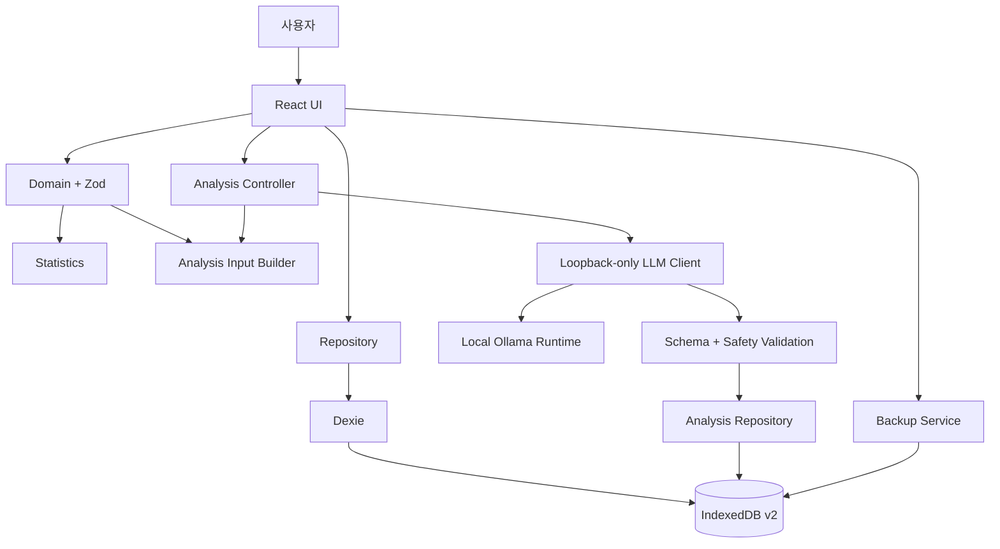

# 하루결 — Daily Diet Log

> 매일의 식사·체중·운동·컨디션을 기록하고, 주간 흐름과 로컬 AI 분석으로 생활 패턴을 돌아보는 개인정보 중심 다이어트 로그입니다.


## 프로젝트 개요

하루결은 회원가입과 클라우드 서버 없이 사용할 수 있는 모바일 우선 다이어트 기록 웹 앱입니다. 일일 기록과 분석 결과는 브라우저 IndexedDB에 저장되며, AI 분석도 사용자의 PC에서 실행되는 Ollama 호환 로컬 모델만 호출합니다.

프로젝트는 빈 저장소에서 시작해 다음 단계를 거쳐 구현했습니다.

1. 제품 요구사항과 수용 기준 정의
2. 로컬 우선 아키텍처 및 데이터 모델 설계
3. 모바일 UI 설계와 일일 기록 MVP 구현
4. 월요일 기준 주간 평균 통계 추가
5. 로컬 LLM 분석 및 안전 경계 구현
6. 자동 테스트, 정적 분석과 코드 리뷰

## 현재 상태

| 영역 | 상태 | 검증 |
| --- | --- | --- |
| 일일 기록 MVP | 구현 완료 | 빌드·테스트·린트 통과 |
| 주간 평균 통계 | 구현 완료 | 경계값·결측치·UI 테스트 통과 |
| 로컬 LLM 분석 | 구현 완료 | 사전 로딩·스트리밍·타임아웃·mock 테스트 통과 |
| 실제 Ollama 모델 E2E | 환경 부적합 확인 | `qwen3.6:latest` 로드 중 호스트 메모리 할당 실패 |
| IndexedDB v1→v2 실제 브라우저 마이그레이션 | 검증 필요 | 스키마·저장소 테스트로 대체 |

## 주요 기능

### 일일 기록

- 날짜별 단일 로그 생성·조회·수정·삭제
- 체중, 물 섭취량과 5단계 컨디션 기록
- 아침·점심·저녁·간식별 음식과 열량 입력
- 운동명과 운동 시간 입력
- 자유 메모와 일일 섭취 열량 자동 합산
- 입력 범위 검증과 접근 가능한 오류 피드백

### 기록 탐색과 주간 통계

- 과거 기록 목록과 날짜별 요약
- 월요일~일요일 기준 주간 집계
- 이번 주 평균 체중·섭취 열량·운동 시간
- 지난주 대비 증감량
- 기록 일수와 체중 표본 수 표시
- 최근 8주 평균 체중 추이
- 빈 날짜와 체중 결측치를 0으로 왜곡하지 않는 계산

### 데이터 관리

- 목표 체중과 일일 목표 열량 설정
- 버전이 포함된 JSON 백업·복원
- 최대 10MB 파일 제한과 Zod 스키마 검증
- 중복 날짜 및 손상된 백업 차단
- 확인 절차가 포함된 개별·전체 삭제

### 로컬 AI 분석

- 저장된 날짜와 최근 7일 요약을 사용자가 직접 분석
- Ollama 호환 런타임 연결 확인과 모델 선택
- 분석 요약, 긍정적 패턴, 살펴볼 점과 다음 행동 제공
- 데이터 한계와 안전 안내를 포함한 구조화 JSON 응답
- 생성 취소, 재시도, 캐시와 오래된 결과 감지
- 기록·날짜·모델·프롬프트 버전 기반 캐시 무효화
- 명시적 모델 사전 로딩과 10분 `keep_alive`
- 로딩·생성 단계 및 생성 토큰 진행 상태 표시
- 2분·5분·10분 응답 제한 시간 선택
- 모델 파일 크기와 RAM·VRAM 적합성 경고
- localhost 이외의 LLM endpoint 차단

## 핵심 엔지니어링 포인트

### 1. 로컬 우선 데이터 구조

일일 기록은 `YYYY-MM-DD`를 기본 키로 IndexedDB에 저장합니다. 화면은 Dexie를 직접 호출하지 않고 Repository를 사용하므로 향후 클라우드 저장소를 추가해도 UI와 도메인 로직을 유지할 수 있습니다.

### 2. 파생 통계와 정직한 결측치 처리

열량 합계와 주간 평균은 저장하지 않고 원본 일일 로그에서 계산합니다. 기록하지 않은 체중을 `0kg`으로 채우지 않으며, 평균값과 함께 기록 일수와 체중 표본 수를 제공합니다.

### 3. 구조화된 로컬 LLM 경계

모델 출력은 신뢰하지 않습니다. 모든 응답은 엄격한 Zod 스키마와 안전 검사를 통과해야 저장·표시됩니다. 실패 시 한 번만 JSON 교정 요청을 수행하며 모델 원문은 저장하지 않습니다.

### 4. 건강 데이터와 안전 통제

- `localhost`, `127.0.0.1`, `[::1]`의 HTTP endpoint만 허용
- 사용자명·비밀번호·검색 문자열이 포함된 URL 차단
- 사용자 메모를 신뢰할 수 없는 데이터로 구분
- 의료 진단·처방 및 극단적 감량 조언 차단
- 절식·구토·자해 위험 표현이 있으면 일반 감량 조언을 중단하고 전문 지원 안내 요구
- 프롬프트 정책 변경 시 버전을 올려 기존 캐시 재사용 방지

## 아키텍처



## 기술 스택

| 영역 | 기술 | 역할 |
| --- | --- | --- |
| Frontend | React, TypeScript | 모바일 우선 UI와 상태 관리 |
| Build | Vite | 개발 서버와 프로덕션 번들 |
| Persistence | IndexedDB, Dexie | 일일 기록·설정·AI 분석 캐시 |
| Validation | Zod | 입력, 백업과 모델 응답 검증 |
| Local AI | Ollama-compatible HTTP API | 외부 AI API 없는 로컬 분석 |
| Security | Web Crypto SHA-256 | 분석 입력 캐시 키 생성 |
| Test | Vitest, Testing Library, jsdom | 도메인·AI·저장소·UI 검증 |
| Quality | ESLint | TypeScript와 React 정적 검사 |

## 프로젝트 구조

```text
src/
├─ analysis/              # 분석 요청·응답, 프롬프트, 해시, 안전 정책
├─ app/                   # 앱 셸과 분석 통합 컨트롤러
├─ components/            # 공용 UI 컴포넌트
├─ domain/                # 기록 모델, Zod 스키마, 일별·주간 통계
├─ features/
│  ├─ analysis/           # 로컬 AI 설정·상태·결과 UI
│  └─ insights/           # 주간 평균 통계 UI
├─ llm/                   # 루프백 endpoint 및 Ollama HTTP 어댑터
├─ storage/               # Dexie DB, Repository, 백업 서비스
├─ styles/                # 모바일 우선 스타일
└─ test/
   ├─ ai/                 # 프롬프트·안전·HTTP 어댑터 테스트
   ├─ backend/            # 도메인·통계·저장소 테스트
   └─ frontend/           # 사용자 흐름과 상태 UI 테스트
```

## 시작하기

### 요구 환경

- Node.js 20 이상 권장
- npm
- IndexedDB를 지원하는 최신 브라우저
- AI 분석 사용 시 Ollama 호환 로컬 런타임과 모델

### 앱 실행

```bash
npm install
npm run dev
```

프로덕션 빌드:

```bash
npm run build
```

## 로컬 AI 설정

앱 자체는 모델을 자동으로 설치하거나 다운로드하지 않습니다. Ollama 호환 런타임과 모델을 사용자가 별도로 준비해야 합니다.

예시:

```bash
ollama pull qwen3:8b
ollama run qwen3:8b
```

1. Ollama 서버를 실행합니다.
2. 앱에서 일일 기록을 먼저 저장합니다.
3. `로컬 AI 연결 설정`을 엽니다.
4. 기본 주소 `http://127.0.0.1:11434`로 연결을 확인합니다.
5. 설치된 모델을 선택하고 파일 크기 및 리소스 경고를 확인합니다.
6. 응답 제한 시간을 선택한 뒤 `모델 미리 불러오기`를 실행합니다.
7. 준비 완료 후 `로컬 AI로 분석`을 직접 실행합니다.

모델은 자동 실행되지 않으며 로딩·분석 중 취소할 수 있습니다. 기본 제한 시간은 300초이고 120초 또는 600초로 변경할 수 있습니다. 준비된 모델은 Ollama에 10분간 유지됩니다. 제한 시간을 늘려도 RAM·VRAM이 부족한 모델은 로드할 수 없으므로, 리소스 경고가 표시되면 더 작은 양자화 모델을 선택해야 합니다.

## 테스트

```bash
npm test
npm run lint
npm run build
```

현재 결과:

| 검증 | 결과 |
| --- | --- |
| 프로덕션 빌드 | 통과, 126개 모듈 변환 |
| 자동 테스트 | 10개 파일·72개 테스트 통과 |
| ESLint | 오류·경고 없음 |

주요 테스트 범위:

- 일일 기록 CRUD, 입력 검증과 날짜 전환
- 월요일 기준 주 경계, 윤년, 미래 날짜와 결측치 처리
- 최근 8주 집계와 전주 비교 UI
- 백업 JSON 검증과 중복 날짜 차단
- 루프백 URL 제한과 원격 endpoint 차단
- 모델 연결, 취소, 타임아웃과 오류 정규화
- 모델 사전 로딩, `keep_alive`, 스트리밍 진행 상태와 리소스 진단
- 구조화 출력 교정, 프롬프트 인젝션과 위험 조언 차단
- 분석 캐시, stale 구분과 날짜별 삭제
- 날짜 및 런타임 변경 시 이전 분석 결과 누수 방지

## 개발 워크플로와 산출물

기능별로 요구사항, 기술 설계, 작업 분해, 구현 기록, 테스트와 리뷰 문서를 보존했습니다.

- [일일 기록 MVP](artifacts/wf_20260619_daily_diet_log/)
- [주간 평균 통계](artifacts/wf_20260619_weekly_average_stats/)
- [로컬 LLM 분석](artifacts/wf_20260619_local_llm_analysis/)
- [로컬 AI 런타임 안정화](artifacts/wf_20260619_local_ai_runtime_reliability/)

로컬 LLM 기능은 Frontend Developer, Backend Architect와 AI Engineer가 비중첩 쓰기 범위에서 병렬 구현한 뒤 통합 검증했습니다.

## 개인정보 및 보안

- 원본 기록은 브라우저 IndexedDB에 저장됩니다.
- JSON 백업은 사용자가 직접 내려받거나 가져올 때만 처리됩니다.
- 로컬 AI 분석을 실행할 때만 선택 날짜와 최근 7일 요약이 로컬 LLM 프로세스로 전달됩니다.
- 인증 키·비밀번호·모델 원문 응답은 저장하지 않습니다.
- 외부 LLM endpoint는 사용할 수 없습니다.
- Google Fonts 로딩을 제외하면 앱이 건강 기록을 외부 네트워크로 전송하는 경로는 없습니다.

이 기능은 생활 기록을 정리하기 위한 도구이며 의료 진단이나 치료를 제공하지 않습니다. 로컬 모델의 결과도 전문적인 의료 판단을 대체할 수 없습니다.

## 알려진 제한 사항

- 개발 PC의 `qwen3.6:latest`(약 23.9GB)는 RTX 4070 12GB 환경에서 약 13.2GiB CUDA 호스트 버퍼를 추가 할당하지 못해 로드에 실패합니다. 앱 타임아웃이 아니라 모델과 가용 메모리의 부적합입니다.
- 실제 Ollama 모델의 한국어 품질·속도·JSON 준수율 평가는 7B~9B급 Q4 모델로 다시 수행해야 합니다.
- IndexedDB v1→v2 데이터 보존은 실제 브라우저 통합 테스트가 남아 있습니다.
- Chromium 기반 360px 시각 회귀 테스트가 필요합니다.
- 배포 환경에서는 앱 Origin과 Ollama CORS·mixed-content 동작을 확인해야 합니다.
- 현재는 단일 기기·단일 사용자만 지원합니다.

## 다음 단계

- [ ] `qwen3:8b` 등 후보 모델의 합성 기록 20건 안전·품질 평가
- [ ] 실제 브라우저 IndexedDB 마이그레이션 E2E
- [ ] 모바일 시각 회귀 및 키보드 접근성 자동화
- [ ] 자주 먹는 음식과 식사 템플릿
- [ ] 탄수화물·단백질·지방 영양 분석
- [ ] PWA 설치와 오프라인 자산 캐시
- [ ] 선택적 클라우드 동기화

## 라이선스

현재 별도의 라이선스가 지정되지 않았습니다. 공개 배포 또는 재사용을 허용하려면 `LICENSE` 파일을 추가해야 합니다.
